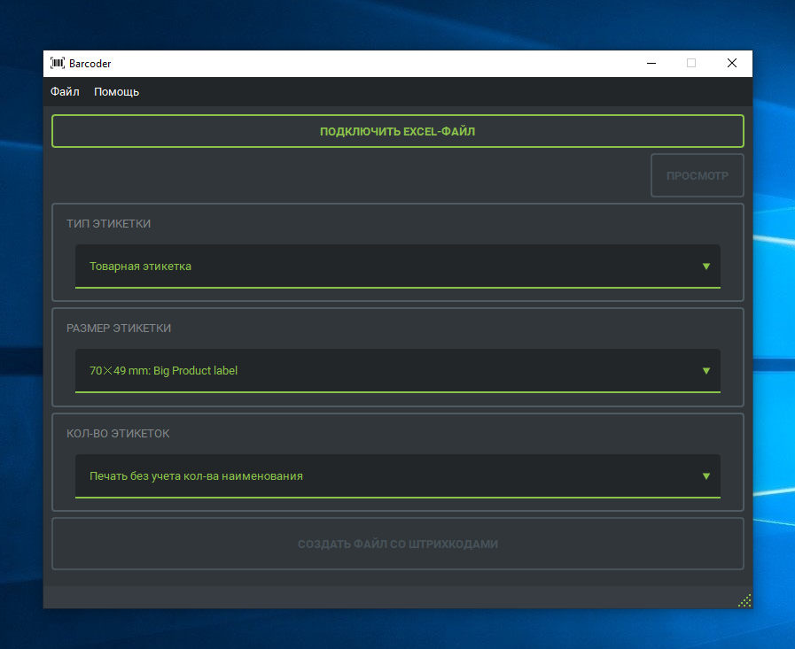

<h1 align="center">Barcoder</h1>

## Описание
Целью этого _приложения_, является автоматизация **создания этикеток** на основе источника данных (файл-Excel),
для последующей печати на принтере (_напр. **TSC ML240**_).

Программный интерфейс написан с использованием графического фреймворка **PySide6** _(Qt for python)_,
а отрисовка этикеток в файл **PDF** осуществляется посредством библиотеки **ReportLab**



### Примечание
Требуется версия **Python 3.10+**

## Установка
Создайте и активируйте виртуальное окружение python. Установите необходмые пакеты.\
После этого необходимо запустить скрипт ```install.py``` который подготовит проект к запуску а также создаст исполняемый контейнер.

### Для Windows:
#### Примечание:
Возможно, необходимо будет изменить политику исполнения скриптов:
```ps1
Set-ExecutionPolicy RemoteSigned -Scope Process
```
```ps1
python -m venv .venv
.venv\Scripts\activate
pip install -r requirements.txt
python install.py
```

### Для Linux:
```bash
python -m venv .venv
source .venv/bin/activate
pip install -r requirements.txt
python install.py
```

## Запуск
Предварительно скомпонованное в исполняемый контейнер приложение (например **_EXE_**) запускается тривиально,
а в случае с **Linux** также необходимо сделать его **исполняемым**:
```bash
chmod +x './dist/Barcoder'
```

### Windows
```ps1
.venv\Scripts\activate
python 'main.py'
```
### Linux
```bash
source '.venv/bin/activate'
python 'main.py'
```

## Использование
Необходим **Excel-файл** с данными, который подключается в приложении.

Вы выбираете соответстующий файлу **"Тип этикетки"**, и предпочитаетмый **"Размер этикетки"**.
Отрисовка этикеток возможна:
- **Без учета количества наименований** (По ум-ю)
- **По полному количеству** (Как указано в файле).

Нажав **"Создать файл со штрихкодами"**, вы выбираете название и расположение создаваемого файла.\
После успешного выполнения будет создан PDF-файл с этикетками, который позже вы можете отправить на печать.
